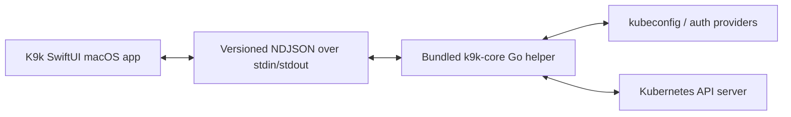

# K9k architecture

K9k is a macOS 26+ SwiftUI application with a bundled, long-lived Go helper. The UI is native macOS; Kubernetes semantics are owned by `k9k-core`. The helper uses direct Kubernetes Go clients and never relies on a separately installed K9s or `kubectl` for normal operations.

## Boundary



Swift owns window lifecycle, navigation, tables, sheets, inspectors, searches, keyboard commands, user confirmation, and Liquid Glass where appropriate. It does not parse kubeconfig, implement Kubernetes authentication, or speak the Kubernetes wire protocol. Go owns client construction, discovery, resource identity, list/watch, typed operations, transport streams, and Kubernetes error normalisation.

## Components

| Area | Current location | Responsibility |
| --- | --- | --- |
| App entry and scenes | `K9k/App/K9kApp.swift` | macOS app lifecycle, main window, Settings scene, shared store injection. |
| IPC client | `K9k/IPC/CoreClient.swift` | Starts helper, writes one JSON request per line, decodes responses/events, matches IDs, terminates helper. |
| Swift values | `K9k/Models/ClusterModels.swift` | Codable context/resource summaries and JSON values for the UI boundary. |
| Protocol | `Backend/internal/protocol/protocol.go` | Version-1 request/envelope/error types over stdin/stdout. |
| Kubernetes domain | `Backend/internal/kube/cluster.go` | `clientcmd` loading, selected context, typed/dynamic/discovery clients, generic list/get/watch/patch/delete primitives. |
| Backend DTOs | `Backend/internal/api/types.go` | Context, resource type, and resource summary wire values. |
| Behavioural source | `.vendor/k9s` | Apache-2.0 K9s reference, pinned in `Docs/K9S_PARITY.md`; its TUI is not embedded. |

## Process lifecycle

1. K9k resolves `k9k-core` relative to `Bundle.main.resourceURL` (`K9K_CORE_PATH` is development-only).
2. `CoreClient.start()` launches `k9k-core serve` with pipes and retains the process/write handle.
3. Requests/events share stdout as NDJSON. Stderr is diagnostics only and must not be parsed as protocol.
4. On quit/deinitialization Swift terminates the child and closes stdin. The helper must cancel watches, exec/attach, logs, and port forwards on EOF or signal.
5. Unexpected helper termination fails outstanding continuations with `helperExited`; the UI can offer controlled relaunch rather than stale cluster state.

The Swift startup code implements steps 1–4. `Backend/internal/api.Server` is now the Go request dispatcher for the baseline context, discovery, generic-resource, scale, watch, and cancellation operations. Reconnect/relist policy remains implementation work.

## Protocol contract

Transport is bidirectional newline-delimited JSON. Every message carries `version: 1`; request/response pairing uses `id`; long-running streams use `streamID`. Responses use `type: "response"`; asynchronous messages use a specific event type and stream ID.

```json
{"version":1,"id":"req-42","operation":"resource.list","params":{"group":"apps","version":"v1","resource":"deployments","namespaced":true,"namespace":"default"}}
{"version":1,"id":"req-42","type":"response","result":{"items":[]}}
{"version":1,"streamID":"watch-17","type":"resource.modified","result":{"object":{}}}
```

Preserve group, version, resource, kind when known, namespace, name, UID, and resourceVersion. `ResourceSummary` is a display optimisation; it never replaces raw structured object data.

| Family | Intended operations | Lifecycle requirement |
| --- | --- | --- |
| Connection | `context.list`, `context.select`, `namespace.list`, `namespace.select` | Context change invalidates clients, discovery, and streams. |
| Discovery | `discovery.list` | Return scope, short names, preferred version, partial-discovery errors. |
| Resources | `resource.list/get/watch/patch/delete` | Raw object plus display data; cancellable watch preserves event/resourceVersion. |
| Diagnostics | `events.watch`, `metrics.watch`, `relationships.get` | Cancellable streams and explicit unsupported/forbidden results. |
| Interactive streams | `logs.*`, `exec.*`, `attach.*` | Stream IDs, ordered data, resize/EOF/cancellation semantics. |
| Operations | `resource.scale/restart`, `portforward.*`, `manifest.apply/delete` | Structured progress, completion, Kubernetes status errors. |
| Security/extensions | `rbac.check`, plugins, Helm, scans | Explicit capability detection and permission errors. |

`stream.cancel` is the common control operation. The helper acknowledges cancellation before dropping state. The frontend cancels streams when views close, scope/selection changes, the helper restarts, or the app quits.

## Kubernetes client model

`Cluster` creates three clients from the selected kubeconfig context:

| Client | Use |
| --- | --- |
| `kubernetes.Interface` | Typed APIs where semantics matter: namespaces, pod logs, events, access reviews, exec/attach setup, scale, port-forward prerequisites. |
| `dynamic.Interface` | Generic CRD/arbitrary GVR list/get/watch/patch/delete without a fixed resource list. |
| `discovery.DiscoveryInterface` | Preferred discovery, scope/kind/short names, REST mapping input, feature detection. |

This follows K9s's `internal/client`, `dao`, `watch`, and `model` model. Focused Apache-2.0 domain logic may be adapted with attribution, but K9k must not embed tcell/tview or shell out to K9s.

## Concurrency and safety

- Go owns client state. Cancel all long-lived stream contexts before/during a context change.
- `CoreClient` is `@MainActor`; events update observable UI state on that actor.
- Every request continuation resolves exactly once on response, failure, cancellation, timeout, or helper exit.
- Mutations send full object identity and resourceVersion/preconditions where supported; conflicts and forbidden errors remain distinct.
- A central read-only/RBAC/confirmation policy guards every mutation before IPC.

## Native macOS presentation mapping

| K9s terminal concept | K9k macOS representation |
| --- | --- |
| Resource command/table | Sidebar category/discovery browser and searchable native `Table`. |
| `:ctx` / `:ns` | Toolbar/menu picker with visible persistent scope. |
| YAML/describe page | Detail inspector with raw YAML/JSON and structured sections. |
| Key hints/hotkeys | Menu commands, shortcuts, contextual toolbar, accessibility labels. |
| Confirmation modal | Native alert/sheet with selected resource and irreversible-effect wording. |
| XRay tree | Native outline/graph and inspector. |
| Log text view | Native streaming log view with filter, autoscroll, timestamp, wrap, copy, save. |
| TUI suspension | Native terminal/editor surface; no process-wide suspension. |

Liquid Glass belongs to navigation, toolbars, inspectors, and transient controls where system materials improve orientation. Dense resource tables, logs, YAML, and errors prioritise contrast and legibility.

## Dependencies and verification

The K9s pin declares Go `1.25.8` (README minimum 1.23.x); K9k's backend also declares Go `1.25.8` and uses Kubernetes modules `v0.35.3`. Keep backend Kubernetes modules in a compatible family. Add `cli-runtime`, `kubectl`, metrics, Helm, or scanner libraries only as their parity rows are implemented and tested.

The app bundle is the product boundary: build places the architecture-appropriate helper in `K9k.app` resources. Normal users need no Go, K9s, kubectl, or daemon. Reproducible tooling/tasks live in `mise.toml`.

Verification sequence: protocol and fake-client unit tests; launched-helper end-to-end IPC/cancellation/EOF tests; Swift fragmented-NDJSON and helper-exit tests; SwiftUI scope/list/detail/confirmation snapshots; then packaged-app validation without `K9K_CORE_PATH` against a disposable cluster.
