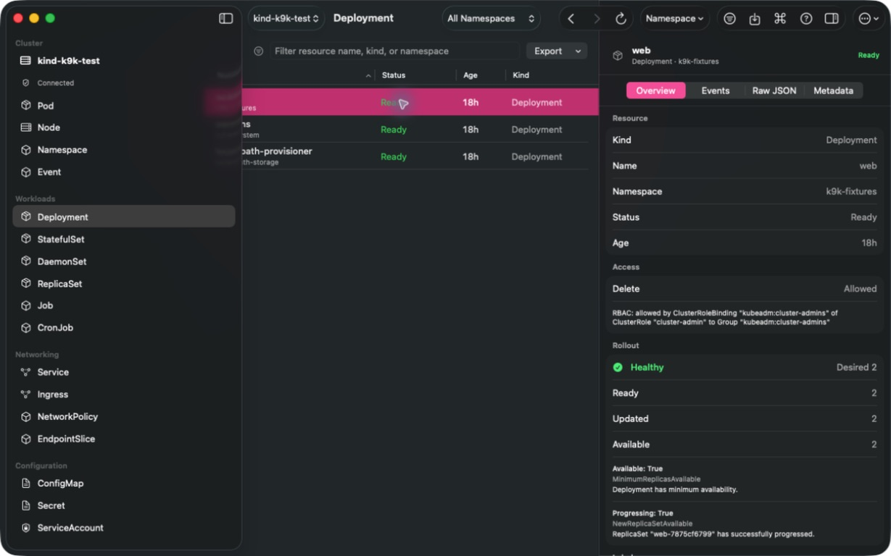
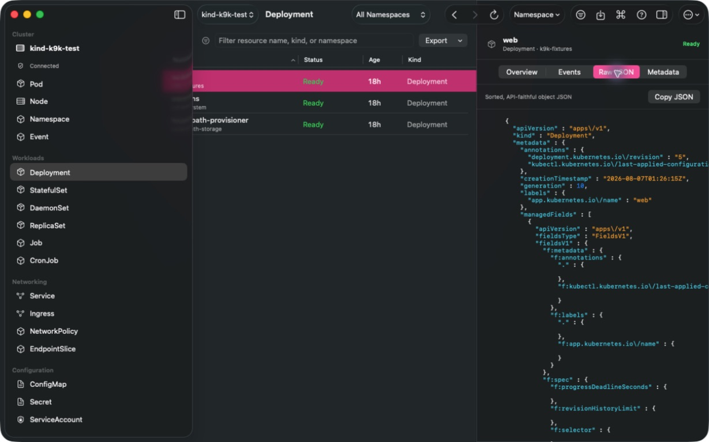

# K9k

**K9s operational depth, designed as a native macOS app.**

K9k is a macOS Tahoe 26+ Kubernetes manager built with SwiftUI and a bundled Go `client-go` helper. It speaks directly to the active kubeconfig context—there is no Electron shell, webview, embedded TUI, or required `kubectl` installation for normal cluster operations.

> K9s defines the Kubernetes workflows. Apple’s native macOS design defines the interface.



<p align="center"><sub>Live fixture-cluster capture: resource browser, native inspector, rollout health, RBAC preflight, and Kubernetes metadata in one window.</sub></p>

## What it feels like

Open a cluster, choose a namespace, and move through live resources in a dense native table. The sidebar, command palette, inspector, sheets, and toolbar are standard macOS controls; Kubernetes semantics stay in the bundled helper.

```text
Cluster → Namespace → Deployment → Inspector → Rollout / Events / Raw JSON
                                      ↘ Scale · Restart · Roll back · Edit manifest
```

## Production workflows

- Browse built-in resources and CRDs through discovery, with live list/watch updates.
- Filter, sort, select, export, and inspect resources without leaving the app; save named per-context production and staging query scopes.
- Inspect syntax-highlighted raw JSON, metadata, owners, annotations, events, RBAC, rollout state, and available metrics.
- Stream logs; open a real ANSI/VT Pod terminal; attach; add a confirmed ephemeral debug container.
- Transfer regular files or directories directly to and from a Pod through bounded, traversal-safe tar streams over `pods/exec`.
- Create loopback-only Pod or Service port-forwards, manage several at once, and benchmark a K9k-owned forward.
- Scale, restart, roll back Deployments, trigger CronJobs, cordon/drain Nodes, and apply UID-protected manifests.
- Import up to 100 mixed-resource manifests from pasted YAML, files, or a directory: live discovery resolves each GVR, every document dry-runs before a confirmed, explicitly non-atomic apply.
- Manage kubeconfig context references graphically, including default namespace, duplicate, rename, delete, and switch.
- See K9s aliases, custom views, jumps, hotkeys, and plugins; edit K9s-compatible configuration safely.
- Browse metadata-only Helm release revisions, use native navigation history, and check access with a graphical `kubectl auth can-i` equivalent.

### Example: inspect and safely change a rollout

1. Select **Deployment** in the sidebar and choose a workload.
2. Read readiness, revision, conditions, related events, and RBAC access in the inspector.
3. Use **More → Scale**, **Restart**, or select an inactive ReplicaSet and **Roll Back**.
4. Every mutating action is access-reviewed, read-only-aware, and confirmed.

### Example: work inside a production Pod

1. Select a Pod, then choose **More → Open Terminal**.
2. Pick the container and a shell program (`/bin/sh`, `/bin/bash`, `/bin/ash`, or `sh`).
3. The terminal is a native SwiftTerm VT surface with resize, Unicode, ANSI color, scrollback, and copy/paste. Input goes directly to Kubernetes `pods/exec`; it never runs through a local shell.

### Example: a safe production change without tab-hopping

```text
⌘K  →  Deployments  →  api  →  Overview
                                  ├─ inspect rollout + recent Events
                                  ├─ check “can I patch?” with active identity
                                  └─ More → Scale → confirm
```

K9k keeps the cluster context, namespace scope, selected resource, and navigation history together. The action remains deliberately close to the evidence: its health, raw object, owners, RBAC answer, and live events are all immediately available in the inspector.

### Raw object fidelity



<p align="center"><sub>Live fixture-cluster capture: inspect the API-faithful object without leaving the resource browser.</sub></p>

## Architecture

```text
SwiftUI macOS app
  ├─ NavigationSplitView · Table · Inspector · Sheets · Swift Charts
  └─ versioned NDJSON IPC
        └─ bundled Go helper
              └─ client-go typed, dynamic, discovery, metrics, SPDY APIs
                    └─ active kubeconfig context
```

The app never reads kubeconfig credentials into Swift. The helper owns Kubernetes authentication, applies direct API calls, and returns structured results and errors.

## Requirements

- macOS Tahoe 26+
- Xcode 26+
- [mise](https://mise.jdx.dev/)

## Build and run

```sh
mise install
mise run bootstrap
mise run build
mise run test
mise run run
```

The Debug app is built at `DerivedData/Build/Products/Debug/K9k.app`. `mise run build` compiles and bundles `k9k-core` into the app.

For an isolated Kind fixture cluster:

```sh
mise run cluster:create
mise run cluster:seed
mise run run
```

These tasks use the disposable `kind-k9k-test` context. Switch back to your production context before opening K9k against a real environment.

## Safety model

- Explicit confirmation for destructive and mutating operations.
- Native read-only mode disables mutation paths.
- Direct API client; no recurring `kubectl get` subprocesses.
- Port forwards bind to loopback only.
- Manifest edits can compare imported YAML with a UID-pinned live object through a server-side-apply dry run (unified or structured diff), then dry-run before apply; they preserve UID identity and never force field ownership.
- Kubeconfig credentials and endpoints remain opaque to the Swift UI.

## Parity status

K9k is actively developed and deliberately candid about parity. It covers many high-value K9s workflows today, but it is not yet complete K9s parity. Notable remaining areas include host SSH, Helm mutation actions, image scanning, manifest-directory follow/delete workflows, and specialised K9s views. Node Shell is available through an explicitly configured, existing trusted DaemonSet rather than an automatically created privileged Pod.

See [K9S_PARITY.md](Docs/K9S_PARITY.md) for the source-pinned capability ledger, [ARCHITECTURE.md](Docs/ARCHITECTURE.md) for design, and [IPC_PROTOCOL.md](Docs/IPC_PROTOCOL.md) for the helper contract.

## Provenance

K9k was seeded from Apple’s official Liquid Glass Landmarks sample. The exact source and transformation record are in [APPLE_SAMPLE_PROVENANCE.md](Docs/APPLE_SAMPLE_PROVENANCE.md).
